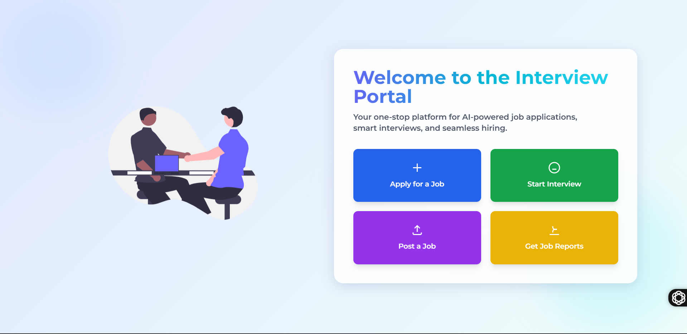
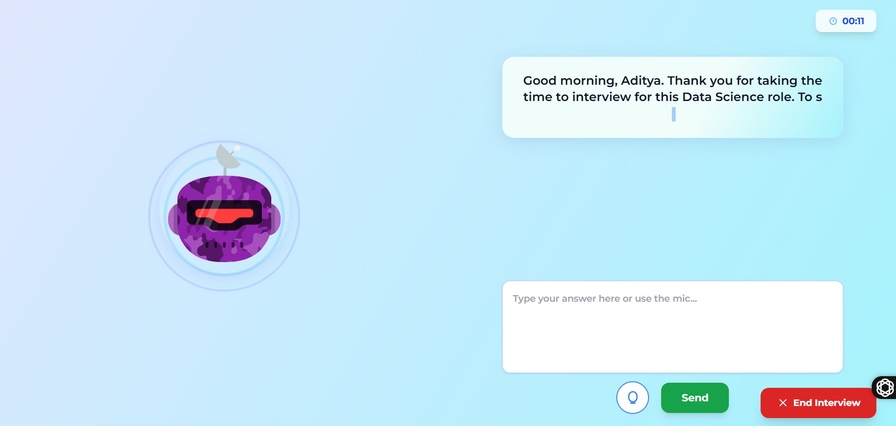
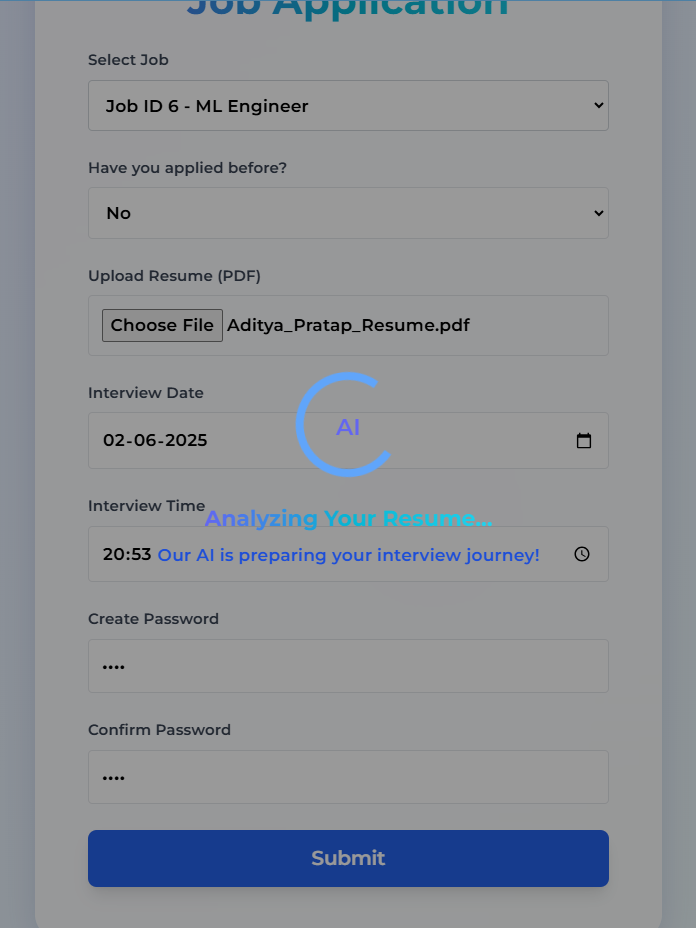
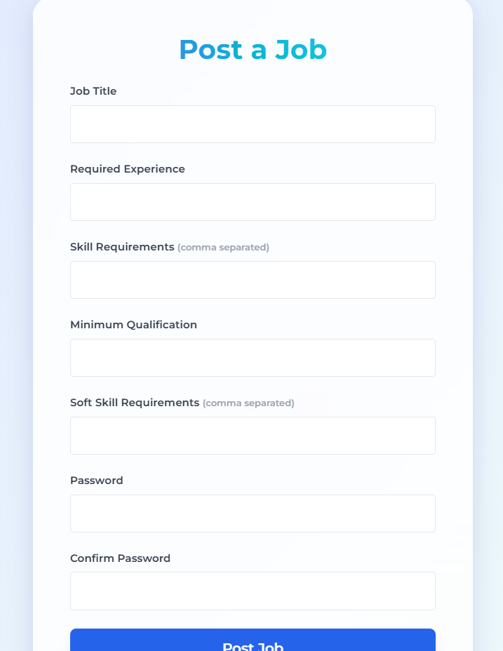
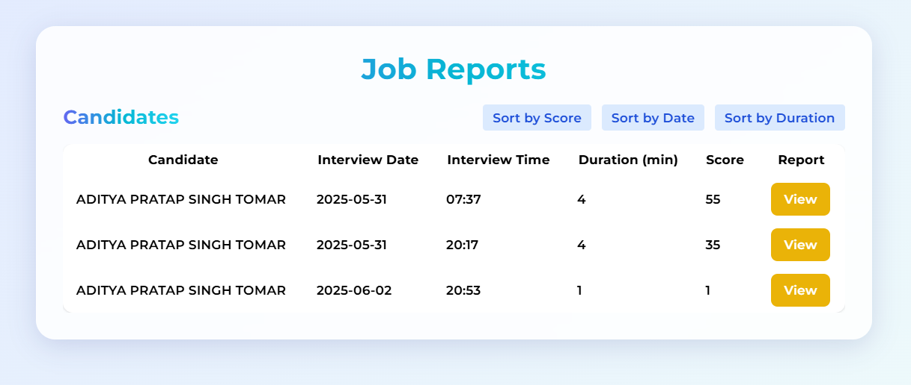
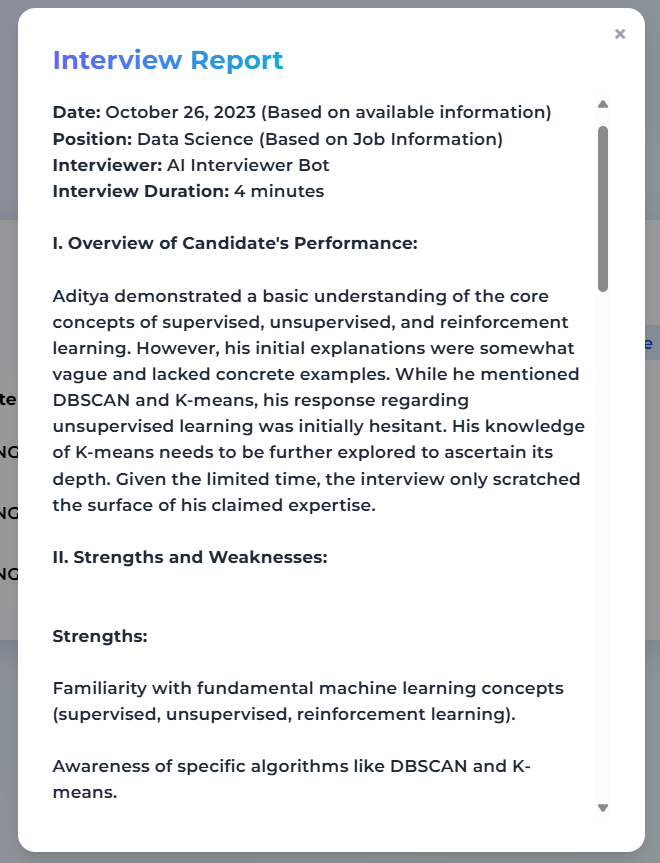

# 🤖 AI-Driven Interviewer Platform
WATCH DEMO VIDEO HERE
[](https://youtu.be/mnJDEoX0Bqo)

---

## 📝 Project Description

**AI-Driven Interviewer Platform** is an innovative application designed to streamline the recruitment process by automating interviews using AI. Companies can post job listings, and applicants can apply by uploading their resumes. The standout feature is the AI-powered dynamic interview system that tailors questions based on the job requirements and the candidate's resume.

---

## 🚀 Features

1. **Job Posting**: Companies can create and manage job listings.
2. **Resume Submission**: Applicants can apply for jobs by uploading their resumes.
3. **AI-Powered Interviews**:
   - The AI interviewer asks context-aware questions based on the uploaded resume and the specific job description.
   - The system starts with easier questions and adapts dynamically:
     - Increases question difficulty when the candidate is doing well.
     - Simplifies questions or shifts topics when the candidate struggles.
     - Varies between theory, scenario-based, and practical questions.
     - Maintains a professional, helpful tone and avoids rushing the process.
     - Encourages learning by giving simpler related questions when needed.
   - This creates a smooth, human-like interview experience tailored to each applicant.
4. **Comprehensive Reports**:
   - Generates detailed reports including question-answer logs and a performance score out of 100.
   - Allows recruiters to sort and shortlist candidates based on performance.

---

## 🛠️ Tech Stack

- **Frontend**: HTML, CSS, JavaScript
- **Backend**: Python - Flask
- **AI & LLM Integration**:
  - LangChain
  - Gemini API (Can be replaced with ChatGPT API)
  - Experiments done with HuggingFace and Ollama; Gemini was preferred for better efficiency in deployment.
- **Speech-to-Text**: Vosk
- **Database**: MySQL (SQLAlchemy as ORM)

---

## 🖥️ Installation Instructions

1. **Clone the Repository**:
   ```bash
   git clone https://github.com/TheAditya-10/Interviewer.git
   cd Interviewer
   ```

2. **Create a Virtual Environment**:
   ```bash
   python -m venv venv
   source venv/bin/activate  # On Windows: venv\Scripts\activate
   ```

3. **Install Dependencies**:
   ```bash
   pip install -r requirements.txt
   ```

4. **Set Up Environment Variables**:
   - Create a `.env` file in the root directory.
   - Add your API keys and other configurations:
     ```
     GEMINI_API_KEY=your_gemini_api_key
     ```

5. **Run the Application**:
   ```bash
   python app.py
   ```

6. **Access the Application**:
   - Open `http://localhost:5000` in your browser.

---

## 📖 Usage Guide

1. **For Companies**:
   - Post job listings with required skills, experience, qualification and other criteria.
   - Review applicants score.
   - View detailed performance reports.

2. **For Applicants**:
   - Register and log in.
   - Browse job listings.
   - Upload resume and schedule AI interview.
   - Start and give an AI Driven Interview.

---

## 📸 Screenshots

> *Note: Replace the image links with actual screenshots of your application.*

1. **Home Page**:
   

2. **AI Interview Interface**:
   

3. **Job Apply**:
   

4. **Posting Job**:
   

5. **Interview Report**:
   
   

---

## 🤝 Contributing

Contributions are welcome! Please follow these steps:

1. Fork the repository.
2. Create a new branch:
   ```bash
   git checkout -b feature/YourFeature
   ```
3. Commit your changes:
   ```bash
   git commit -m "Add YourFeature"
   ```
4. Push to the branch:
   ```bash
   git push origin feature/YourFeature
   ```
5. Open a pull request.
